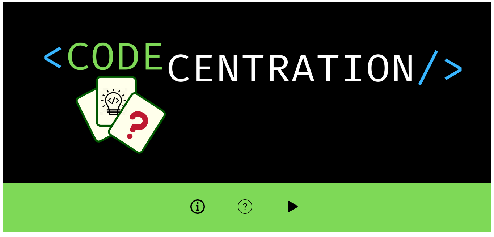

# Memory Match Game

## CODECENTRATION

Codecentration es un juego de memoria creado para una usuaria de 30 años de edad, que quiere adentrarse en el mundo del desarrollo web; por lo tanto, quiere familiarizarse con algunos elementos básicos del web development, y a su vez practicar el inglés, por esta razón el juego está en inglés.

El juego cuenta con dos partes, la página de inicio y el juego como tal.

## Página de inicio

En la página de inicio se encuentra el nombre del juego, junto a tres botones: 'about', 'how to play', y 'play'.

## Botón 'About'

Al darle click al botón 'about', se muestra una breve descripción del juego.

## Botón 'How to play'

 
Al hacer click en el botón 'How to play', muestra las instrucciones del juego.

## Botón 'Play'

 Finalmente, el botón 'play' muestra el juego.

## Memory game

La página del juego, muestra un tablero con 20 cartas boca abajo y un botón para reiniciar el juego volviendo al principio. En cuanto al juego, el usuario debe elegir dos cartas, éstas se darán vuelta para verificar si hay una coincidencia, de ser así, las cartas desaparecerán; si no hay coincidencia, las cartas volverán a su posición inicial. La idea es que el usuario consiga los 10 pares de cartas, cuando esto ocurra aparecerá un mensaje indicándole que ha ganado el juego.

